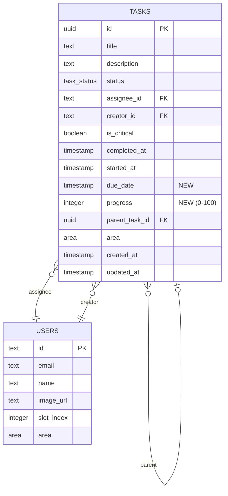

# feat: Task Enhancements V2

## Overview

Implementar 4 mejoras al sistema de tareas para aumentar visibilidad y control del equipo:

1. **Due Date** - Fecha de entrega con indicadores visuales
2. **Eliminar página Backlog** - Simplificar navegación
3. **Filtro "Mis Tareas"** - Toggle en Kanban para ver solo tareas propias
4. **Progress Bar** - Slider 0-100% editable por el responsable

## Technical Approach

### Schema Changes (Drizzle Migration)

```typescript
// db/schema.ts - Agregar a tabla tasks
dueDate: timestamp('due_date'),
progress: integer('progress').default(0),
```

**Migración SQL generada:**
```sql
ALTER TABLE tasks ADD COLUMN due_date TIMESTAMP;
ALTER TABLE tasks ADD COLUMN progress INTEGER DEFAULT 0;
```

### Architecture

```
┌─────────────────────────────────────────────────────────────────┐
│                         CHANGES                                 │
├─────────────────────────────────────────────────────────────────┤
│  DB Layer                                                       │
│  └─ db/schema.ts (+2 campos)                                    │
│                                                                 │
│  Data Layer                                                     │
│  ├─ app/actions/tasks.ts (+2 actions, update schemas)           │
│  ├─ app/actions/kanban.ts (update types + queries)              │
│  └─ app/actions/team.ts (add progress to query)                 │
│                                                                 │
│  UI Layer                                                       │
│  ├─ components/task-card.tsx (due date badge + progress bar)    │
│  ├─ components/team-slot.tsx (progress bar)                     │
│  ├─ components/kanban-board.tsx (filter toggle + logic)         │
│  ├─ components/create-task-dialog.tsx (date picker)             │
│  ├─ components/task-detail-dialog.tsx (date + slider)           │
│  └─ components/sidebar.tsx (remove backlog link)                │
│                                                                 │
│  Routing                                                        │
│  └─ app/(dashboard)/dashboard/backlog/page.tsx → redirect       │
└─────────────────────────────────────────────────────────────────┘
```

## Implementation Phases

### Phase 1: Database & Schema (Fundación)

#### Task 1.1: Agregar campos a schema
**Archivo:** `db/schema.ts`

```typescript
// Agregar después de parentTaskId (línea 67)
dueDate: timestamp('due_date'),
progress: integer('progress').default(0),
```

#### Task 1.2: Generar y ejecutar migración
```bash
pnpm drizzle-kit generate
pnpm drizzle-kit push
```

#### Task 1.3: Actualizar tipos en kanban.ts
**Archivo:** `app/actions/kanban.ts`

```typescript
// Actualizar KanbanTaskData (línea 13-32)
export type KanbanTaskData = {
  // ... campos existentes
  dueDate: Date | null;      // NUEVO
  progress: number;          // NUEVO
};

// Actualizar query getKanbanData para incluir nuevos campos
```

#### Task 1.4: Actualizar tipos en team.ts
**Archivo:** `app/actions/team.ts`

```typescript
// Actualizar TeamSlotData.inProgressTask para incluir progress
inProgressTask: {
  // ... campos existentes
  progress: number;  // NUEVO
} | null;
```

---

### Phase 2: Due Date Feature

#### Task 2.1: Server Actions para Due Date
**Archivo:** `app/actions/tasks.ts`

```typescript
// Nuevo schema de validación
const updateDueDateSchema = z.object({
  taskId: z.string().uuid('Invalid task ID'),
  dueDate: z.coerce.date().nullable(),
});

// Nueva action
export async function updateTaskDueDate(
  input: z.infer<typeof updateDueDateSchema>
): Promise<ActionResponse<typeof tasks.$inferSelect>> {
  // Verificar auth
  // Verificar que usuario es CREADOR de la tarea
  // Actualizar dueDate
  // Log activity
  // Revalidate paths
}

// Actualizar createTaskSchema para incluir dueDate
const createTaskSchema = z.object({
  // ... campos existentes
  dueDate: z.coerce.date().optional(),
});
```

**Permisos:** Solo el CREADOR puede editar dueDate.

#### Task 2.2: Date Picker en Create Task Dialog
**Archivo:** `components/create-task-dialog.tsx`

Agregar después del campo descripción:

```tsx
<div className="space-y-2">
  <label className="text-xs font-bold uppercase tracking-widest text-muted-foreground">
    Fecha de entrega
  </label>
  <input
    type="date"
    name="dueDate"
    value={dueDate}
    onChange={(e) => setDueDate(e.target.value)}
    min={new Date().toISOString().split('T')[0]}
    className="w-full rounded-xl border border-white/5 bg-white/5 px-4 py-3 text-sm backdrop-blur-xl focus:border-primary/50 focus:outline-none focus:ring-2 focus:ring-primary/20"
  />
</div>
```

#### Task 2.3: Due Date Badge en Task Card
**Archivo:** `components/task-card.tsx`

```tsx
// Helper function para calcular estado
function getDueDateStatus(dueDate: Date | null): 'overdue' | 'soon' | 'normal' | null {
  if (!dueDate) return null;
  const now = new Date();
  const diffMs = dueDate.getTime() - now.getTime();
  const diffDays = diffMs / (1000 * 60 * 60 * 24);

  if (diffDays < 0) return 'overdue';      // Vencida (ROJO)
  if (diffDays <= 1) return 'soon';        // Próxima 24h (AMARILLO)
  return 'normal';                          // Normal (sin indicador especial)
}

// En el footer de TaskCard, agregar:
{task.dueDate && (
  <DueDateBadge date={task.dueDate} status={getDueDateStatus(task.dueDate)} />
)}
```

**Colores:**
- Rojo: `text-red-400 bg-red-500/10`
- Amarillo: `text-amber-400 bg-amber-500/10`
- Normal: `text-muted-foreground`

#### Task 2.4: Due Date en Task Detail Dialog
**Archivo:** `components/task-detail-dialog.tsx`

- Mostrar date picker editable si `currentUserId === task.creatorId`
- Mostrar fecha read-only si no es creador
- Llamar `updateTaskDueDate` al cambiar

---

### Phase 3: Eliminar Página Backlog

#### Task 3.1: Redirect en página backlog
**Archivo:** `app/(dashboard)/dashboard/backlog/page.tsx`

Reemplazar contenido completo con:

```typescript
import { redirect } from 'next/navigation';

export default function BacklogPage() {
  redirect('/dashboard/kanban');
}
```

#### Task 3.2: Eliminar enlace del sidebar
**Archivo:** `components/sidebar.tsx`

Eliminar del array `navItems` (líneas 22-27):
```typescript
// ELIMINAR este objeto:
{
  title: "Pila de Tareas",
  href: "/dashboard/backlog",
  icon: ListTodo,
  description: "Prioriza trabajo pendiente",
},
```

#### Task 3.3: Eliminar componente BacklogList (opcional)
**Archivo:** `components/backlog-list.tsx`

Eliminar archivo si ya no se usa en ningún otro lugar.

---

### Phase 4: Filtro "Mis Tareas"

#### Task 4.1: Agregar estado y toggle en Kanban Board
**Archivo:** `components/kanban-board.tsx`

```tsx
// Nuevo estado
const [showOnlyMyTasks, setShowOnlyMyTasks] = useState(false);

// Obtener userId del contexto (necesario para filtrar)
// Opción: pasar como prop desde el server component padre

// Función de filtrado
const filterTasks = (tasks: KanbanTaskData[]) => {
  if (!showOnlyMyTasks) return tasks;
  return tasks.filter(task => task.assignee?.id === currentUserId);
};

// UI del toggle (encima del grid de columnas)
<div className="mb-4 flex justify-end">
  <button
    onClick={() => setShowOnlyMyTasks(!showOnlyMyTasks)}
    className={cn(
      "flex items-center gap-2 rounded-xl px-4 py-2 text-sm font-medium transition-all",
      showOnlyMyTasks
        ? "bg-primary text-primary-foreground"
        : "bg-white/5 text-muted-foreground hover:bg-white/10"
    )}
  >
    <User className="h-4 w-4" />
    Mis Tareas
  </button>
</div>
```

#### Task 4.2: Pasar userId al componente
**Archivo:** `app/(dashboard)/dashboard/kanban/page.tsx`

```typescript
// Pasar currentUserId como prop
<KanbanBoard initialData={kanbanData} currentUserId={userId} />
```

#### Task 4.3: Mensaje cuando columna está vacía
**Archivo:** `components/kanban-column.tsx`

```tsx
// Si no hay tareas después del filtro
{tasks.length === 0 && (
  <div className="flex flex-col items-center justify-center py-8 text-center">
    <p className="text-xs text-muted-foreground">
      {isFiltered ? "No tienes tareas en esta etapa" : "Sin tareas"}
    </p>
  </div>
)}
```

---

### Phase 5: Progress Bar

#### Task 5.1: Server Action para Progress
**Archivo:** `app/actions/tasks.ts`

```typescript
const updateProgressSchema = z.object({
  taskId: z.string().uuid('Invalid task ID'),
  progress: z.number().int().min(0).max(100),
});

export async function updateTaskProgress(
  input: z.infer<typeof updateProgressSchema>
): Promise<ActionResponse<typeof tasks.$inferSelect>> {
  const { userId } = await getAuth();
  if (!userId) return { success: false, error: 'Unauthorized' };

  const { taskId, progress } = updateProgressSchema.parse(input);

  // Fetch task
  const [task] = await db.select().from(tasks).where(eq(tasks.id, taskId)).limit(1);
  if (!task) return { success: false, error: 'Task not found' };

  // Verificar permisos: assignee O creador (si no hay assignee)
  const canEdit = task.assigneeId === userId ||
                  (!task.assigneeId && task.creatorId === userId);

  if (!canEdit) {
    return { success: false, error: 'Solo el asignado puede actualizar el progreso' };
  }

  // Actualizar
  const [updated] = await db
    .update(tasks)
    .set({ progress, updatedAt: new Date() })
    .where(eq(tasks.id, taskId))
    .returning();

  revalidatePath('/');
  revalidatePath('/kanban');

  return { success: true, data: updated };
}
```

#### Task 5.2: Progress Bar en Task Card
**Archivo:** `components/task-card.tsx`

```tsx
// Mostrar mini progress bar si progress > 0
{task.progress > 0 && (
  <div className="mt-2 h-1.5 w-full overflow-hidden rounded-full bg-white/10">
    <div
      className="h-full rounded-full bg-primary transition-all"
      style={{ width: `${task.progress}%` }}
    />
  </div>
)}
```

#### Task 5.3: Progress Slider en Task Detail Dialog
**Archivo:** `components/task-detail-dialog.tsx`

```tsx
// Verificar si puede editar
const canEditProgress = task.assigneeId === currentUserId ||
                        (!task.assigneeId && task.creatorId === currentUserId);

// UI
<div className="space-y-2">
  <label className="text-xs font-bold uppercase tracking-widest text-muted-foreground">
    Progreso
  </label>
  {canEditProgress ? (
    <input
      type="range"
      min="0"
      max="100"
      value={progress}
      onChange={(e) => setProgress(Number(e.target.value))}
      onMouseUp={() => handleProgressSave()}  // Guardar al soltar
      onTouchEnd={() => handleProgressSave()}
      className="w-full accent-primary"
    />
  ) : (
    <div className="h-2 w-full overflow-hidden rounded-full bg-white/10">
      <div
        className="h-full rounded-full bg-primary"
        style={{ width: `${task.progress}%` }}
      />
    </div>
  )}
  <span className="text-xs text-muted-foreground">{progress}%</span>
</div>
```

#### Task 5.4: Progress Bar en Team Slot
**Archivo:** `components/team-slot.tsx`

```tsx
// Dentro de la sección de tarea activa (línea ~105)
{inProgressTask && (
  <>
    <p className="line-clamp-2 text-xs font-bold leading-relaxed">
      {inProgressTask.title}
    </p>

    {/* Progress bar */}
    {inProgressTask.progress > 0 && (
      <div className="mt-2 space-y-1">
        <div className="h-1.5 w-full overflow-hidden rounded-full bg-white/10">
          <div
            className="h-full rounded-full bg-primary transition-all"
            style={{ width: `${inProgressTask.progress}%` }}
          />
        </div>
        <span className="text-[9px] text-muted-foreground">{inProgressTask.progress}%</span>
      </div>
    )}
  </>
)}
```

---

## Acceptance Criteria

### Functional Requirements

- [ ] **Due Date**
  - [ ] Crear tarea con fecha de entrega opcional
  - [ ] Ver indicador rojo si vencida
  - [ ] Ver indicador amarillo si vence en 24h
  - [ ] Solo creador puede editar fecha

- [ ] **Backlog**
  - [ ] /dashboard/backlog redirige a /dashboard/kanban
  - [ ] Enlace "Pila de Tareas" no aparece en sidebar
  - [ ] Columna "Pila de Tareas" sigue funcionando en Kanban

- [ ] **Filtro Mis Tareas**
  - [ ] Toggle visible encima de columnas Kanban (derecha)
  - [ ] Al activar, todas las columnas muestran solo tareas asignadas al usuario
  - [ ] Al desactivar, vuelve a mostrar todas las tareas
  - [ ] Columnas vacías muestran mensaje "No tienes tareas en esta etapa"

- [ ] **Progress Bar**
  - [ ] Slider 0-100% en Task Detail Dialog
  - [ ] Solo asignado (o creador si no hay asignado) puede editar
  - [ ] Guardar al soltar el slider
  - [ ] Mini progress bar en TaskCard (Kanban)
  - [ ] Progress bar en TeamSlot (Dashboard)

### Non-Functional Requirements

- [ ] Migración de DB no rompe datos existentes
- [ ] UI responsive en mobile
- [ ] Optimistic updates para progress (UX fluida)

---

## ERD (Entity Relationship Diagram)



---

## Files to Modify Summary

| File | Changes |
|------|---------|
| `db/schema.ts` | +2 campos (dueDate, progress) |
| `app/actions/tasks.ts` | +2 actions, update createTaskSchema |
| `app/actions/kanban.ts` | Update KanbanTaskData, queries |
| `app/actions/team.ts` | Add progress to TeamSlotData |
| `components/task-card.tsx` | Due date badge, mini progress bar |
| `components/team-slot.tsx` | Progress bar |
| `components/kanban-board.tsx` | Filter toggle + logic |
| `components/kanban-column.tsx` | Empty state message |
| `components/create-task-dialog.tsx` | Date picker |
| `components/task-detail-dialog.tsx` | Date picker + progress slider |
| `components/sidebar.tsx` | Remove backlog link |
| `app/(dashboard)/dashboard/backlog/page.tsx` | Replace with redirect |
| `app/(dashboard)/dashboard/kanban/page.tsx` | Pass userId to KanbanBoard |

---

## References

- Brainstorm: `docs/brainstorms/2026-02-04-task-enhancements-v2-brainstorm.md`
- Schema actual: `db/schema.ts:54-77`
- Server actions patrón: `app/actions/tasks.ts:104-195`
- TaskCard: `components/task-card.tsx`
- KanbanBoard: `components/kanban-board.tsx`
