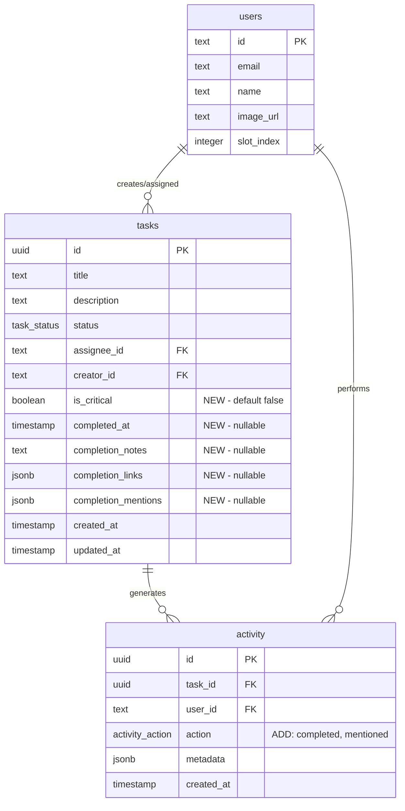

# feat: Backlog Funcional + Cierre de Ciclo de Tareas

## Overview

Implementar dos features interconectadas que completan el ciclo de vida de tareas en Mira:

1. **Backlog Funcional** - Vista de lista con prioridad crítica y drag & drop visual
2. **Cierre de Ciclo** - Modal de completar con notas, links, @menciones + gamificación (confetti)
3. **Activity Mejorado** - Filtros para Todos/Completados/Mis Menciones

**Spec completo:** `specs/backlog-y-cierre-ciclo.md`

---

## Problem Statement

Actualmente:
- La página `/dashboard/backlog` solo muestra skeleton (placeholder)
- No hay forma de marcar tareas como urgentes/críticas
- Al completar una tarea, solo se mueve a Done sin contexto ni celebración
- El activity feed no tiene filtros ni seguimiento de menciones
- No hay gamificación que motive completar tareas

**Impacto:** El equipo no tiene visibilidad del progreso y completar tareas no se siente satisfactorio.

---

## Technical Approach

### Arquitectura

```
┌─────────────────────────────────────────────────────────────────────┐
│                        CAMBIOS DE BASE DE DATOS                      │
├─────────────────────────────────────────────────────────────────────┤
│                                                                      │
│  Tabla: tasks (modificar)                                            │
│  ┌─────────────────────────────────────────────────────────────┐    │
│  │ + is_critical: boolean DEFAULT false                        │    │
│  │ + completed_at: timestamp NULL                              │    │
│  │ + completion_notes: text NULL                               │    │
│  │ + completion_links: jsonb NULL  -- ["url1", "url2"]         │    │
│  │ + completion_mentions: jsonb NULL  -- ["userId1", "userId2"]│    │
│  └─────────────────────────────────────────────────────────────┘    │
│                                                                      │
│  Tabla: activity (modificar enum)                                    │
│  ┌─────────────────────────────────────────────────────────────┐    │
│  │ action enum + 'completed' + 'mentioned'                     │    │
│  └─────────────────────────────────────────────────────────────┘    │
│                                                                      │
└─────────────────────────────────────────────────────────────────────┘

┌─────────────────────────────────────────────────────────────────────┐
│                        NUEVOS COMPONENTES                            │
├─────────────────────────────────────────────────────────────────────┤
│                                                                      │
│  components/                                                         │
│  ├── backlog-list.tsx          # Lista sortable con @dnd-kit        │
│  ├── backlog-task-card.tsx     # Card con toggle crítico            │
│  ├── complete-task-modal.tsx   # Modal de completar                 │
│  ├── mention-input.tsx         # Input con @autocomplete            │
│  ├── link-input.tsx            # Input para agregar URLs            │
│  ├── activity-filters.tsx      # Tabs de filtro                     │
│  └── confetti-celebration.tsx  # Wrapper para canvas-confetti       │
│                                                                      │
│  lib/                                                                │
│  └── confetti.ts               # Funciones de confetti              │
│                                                                      │
└─────────────────────────────────────────────────────────────────────┘

┌─────────────────────────────────────────────────────────────────────┐
│                        SERVER ACTIONS                                │
├─────────────────────────────────────────────────────────────────────┤
│                                                                      │
│  app/actions/tasks.ts (modificar)                                    │
│  ├── toggleTaskCritical(taskId)     # Toggle is_critical            │
│  └── completeTask(taskId, data)     # Completar con notas/links     │
│                                                                      │
│  app/actions/activity.ts (modificar)                                 │
│  └── getActivityFeed(filter?)       # Con filtro opcional           │
│                                                                      │
└─────────────────────────────────────────────────────────────────────┘
```

### ERD - Cambios al Modelo



---

## Implementation Phases

### Phase 1: Database & Schema (Migración)

**Objetivo:** Agregar campos necesarios a la base de datos

**Archivos a modificar:**
- `db/schema.ts` - Agregar campos a tasks, nuevos valores a enum

**Tareas:**
1. Agregar campos a tabla `tasks`:
   ```typescript
   // db/schema.ts:40-48
   is_critical: boolean('is_critical').default(false).notNull(),
   completedAt: timestamp('completed_at'),
   completionNotes: text('completion_notes'),
   completionLinks: jsonb('completion_links'), // string[]
   completionMentions: jsonb('completion_mentions'), // string[]
   ```

2. Modificar enum `activityActionEnum`:
   ```typescript
   // db/schema.ts:16-22
   export const activityActionEnum = pgEnum('activity_action', [
     'created',
     'status_changed',
     'assigned',
     'updated',
     'deleted',
     'completed',  // NUEVO
     'mentioned',  // NUEVO
   ]);
   ```

3. Crear migración con Drizzle

**Criterio de éxito:** Migración aplicada sin errores, campos disponibles en DB

---

### Phase 2: Backlog List (Vista funcional)

**Objetivo:** Reemplazar skeleton con lista funcional de tareas backlog

**Archivos a crear/modificar:**
- `app/(dashboard)/dashboard/backlog/page.tsx` - Página principal
- `components/backlog-list.tsx` - Lista con drag & drop
- `components/backlog-task-card.tsx` - Card con toggle crítico
- `app/actions/tasks.ts` - Agregar `toggleTaskCritical`

**Tareas:**

1. **Server Action: toggleTaskCritical**
   ```typescript
   // app/actions/tasks.ts
   export async function toggleTaskCritical(taskId: string) {
     // Verificar autenticación
     // Si está marcando como crítico:
     //   - Verificar que usuario no tenga otra crítica
     //   - Si tiene, retornar error
     // Toggle is_critical
     // Registrar actividad
     // revalidatePath
   }
   ```

2. **Componente BacklogList**
   ```typescript
   // components/backlog-list.tsx
   // - DndContext con SortableContext
   // - verticalListSortingStrategy
   // - Solo reordena visualmente (useState local)
   // - No persiste orden en DB
   ```

3. **Componente BacklogTaskCard**
   ```typescript
   // components/backlog-task-card.tsx
   // - Basado en task-card.tsx existente
   // - Agregar toggle de crítico (estrella/badge)
   // - Visual: borde rojo + badge "CRÍTICO" si is_critical
   // - useSortable para drag handle
   ```

4. **Página Backlog**
   ```typescript
   // app/(dashboard)/dashboard/backlog/page.tsx
   // - Fetch tareas con status='backlog'
   // - Ordenar: críticas primero, luego por createdAt DESC
   // - Renderizar BacklogList
   ```

**Criterio de éxito:**
- Lista muestra tareas del backlog ordenadas
- Toggle crítico funciona (1 por persona)
- Drag & drop reordena visualmente
- Al refrescar, vuelve al orden por defecto

---

### Phase 3: Complete Task Modal

**Objetivo:** Modal para completar tareas con notas, links y menciones

**Archivos a crear/modificar:**
- `components/complete-task-modal.tsx` - Modal principal
- `components/mention-input.tsx` - Input con @autocomplete
- `components/link-input.tsx` - Input para URLs
- `app/actions/tasks.ts` - Agregar `completeTask`
- `components/kanban-board.tsx` - Integrar modal al drop en Done

**Dependencias nuevas:**
```bash
npm install canvas-confetti
npm install -D @types/canvas-confetti
```

**Tareas:**

1. **Server Action: completeTask**
   ```typescript
   // app/actions/tasks.ts
   export async function completeTask(
     taskId: string,
     data: {
       notes?: string;
       links?: string[];
       mentions?: string[];
     }
   ) {
     // Actualizar tarea:
     //   - status = 'done'
     //   - completed_at = now
     //   - completion_notes, completion_links, completion_mentions
     // Crear activity 'completed'
     // Por cada mención, crear activity 'mentioned'
     // revalidatePath
   }
   ```

2. **Componente MentionInput**
   ```typescript
   // components/mention-input.tsx
   // - Textarea con detección de @
   // - Dropdown con usuarios del equipo
   // - Retorna texto + array de userIds mencionados
   ```

3. **Componente LinkInput**
   ```typescript
   // components/link-input.tsx
   // - Input + botón agregar
   // - Lista de links agregados con botón eliminar
   // - Validación básica de URL
   // - Máximo 10 links
   ```

4. **Componente CompleteTaskModal**
   ```typescript
   // components/complete-task-modal.tsx
   // - Dialog con título "🎉 Completar: [tarea]"
   // - MentionInput para notas
   // - LinkInput para adjuntos
   // - Botones: Cancelar | Completar ✓
   // - onComplete: ejecuta completeTask + dispara confetti
   ```

5. **Integrar en Kanban**
   ```typescript
   // components/kanban-board.tsx
   // - Al drop en columna 'done':
   //   - Abrir CompleteTaskModal
   //   - Si cancela: revertir tarea a columna original
   //   - Si confirma: completar y mostrar confetti
   ```

6. **Confetti**
   ```typescript
   // lib/confetti.ts
   export function fireConfetti() {
     // canvas-confetti con respeto a reduced-motion
   }
   ```

**Criterio de éxito:**
- Modal aparece al arrastrar a Done o botón en detalles
- Notas con @menciones funcionan
- Links se pueden agregar/eliminar
- Cancelar revierte el drag
- Confirmar → confetti + toast + tarea en Done

---

### Phase 4: Activity Feed Filters

**Objetivo:** Agregar filtros al feed de actividad

**Archivos a crear/modificar:**
- `components/activity-filters.tsx` - Tabs de filtro
- `app/(dashboard)/dashboard/activity/page.tsx` - Integrar filtros
- `app/actions/activity.ts` - Modificar query con filtros

**Tareas:**

1. **Modificar getActivityFeed**
   ```typescript
   // app/actions/activity.ts
   export async function getActivityFeed(
     filter?: 'all' | 'completed' | 'mentions'
   ) {
     // Si filter = 'completed': WHERE action = 'completed'
     // Si filter = 'mentions': WHERE action = 'mentioned' AND menciona al usuario actual
     // Incluir completion_notes y completion_links en respuesta
   }
   ```

2. **Componente ActivityFilters**
   ```typescript
   // components/activity-filters.tsx
   // - Tabs: Todos | Completados | Mis Menciones
   // - Estado en URL (?filter=completed)
   // - Contadores opcionales por tab
   ```

3. **Actualizar Activity Page**
   ```typescript
   // app/(dashboard)/dashboard/activity/page.tsx
   // - Leer searchParams.filter
   // - Pasar a getActivityFeed
   // - Renderizar ActivityFilters + lista
   ```

4. **Actualizar ActivityItem para completados**
   ```typescript
   // components/activity-item.tsx
   // - Si action = 'completed':
   //   - Mostrar notas de completion
   //   - Mostrar links como chips clickeables
   //   - Resaltar menciones
   ```

**Criterio de éxito:**
- Tabs funcionan y filtran correctamente
- "Mis Menciones" muestra solo donde el usuario fue tagueado
- Tareas completadas muestran notas y links

---

### Phase 5: Polish & Integration

**Objetivo:** Pulir detalles, UX y testing

**Tareas:**

1. **Botón Completar en TaskDetailDialog**
   ```typescript
   // components/task-detail-dialog.tsx
   // - Agregar botón "Completar" que abre CompleteTaskModal
   // - Funciona desde cualquier estado (backlog, todo, in_progress)
   ```

2. **Card destacada temporal**
   ```typescript
   // components/kanban-board.tsx o task-card.tsx
   // - Después del confetti, la card brilla/pulsa 2-3 segundos
   // - Usar CSS animation o framer-motion
   ```

3. **Toast de notificación global**
   ```typescript
   // Al completar cualquier tarea, toast para todos los usuarios
   // (esto requiere polling o se muestra en próximo refresh)
   ```

4. **Sonido de celebración**
   ```typescript
   // lib/sounds.ts
   // - Sonido corto al completar
   // - Respetar prefers-reduced-motion y sistema muted
   ```

5. **Empty states**
   - Backlog vacío: "No hay tareas en el backlog"
   - Menciones vacías: "No tienes menciones"
   - Completados vacíos: "No hay tareas completadas"

6. **Testing**
   - Test E2E: completar tarea con modal
   - Test E2E: toggle crítico
   - Test E2E: filtros de activity

---

## Acceptance Criteria

### Funcionales

- [ ] **Backlog**: Lista muestra tareas con status `backlog`
- [ ] **Backlog**: Toggle de prioridad crítica (máximo 1 por usuario)
- [ ] **Backlog**: Drag & drop reordena visualmente
- [ ] **Backlog**: Tareas críticas tienen indicador visual rojo
- [ ] **Complete**: Modal aparece al arrastrar tarea a Done
- [ ] **Complete**: Modal aparece desde botón en detalle de tarea
- [ ] **Complete**: Notas con @menciones funcionan
- [ ] **Complete**: Links se pueden agregar (máx 10) y eliminar
- [ ] **Complete**: Cancelar revierte la tarea a columna original
- [ ] **Complete**: Confirmar dispara confetti y mueve a Done
- [ ] **Activity**: Filtro "Todos" muestra toda actividad
- [ ] **Activity**: Filtro "Completados" muestra solo tareas completadas
- [ ] **Activity**: Filtro "Mis Menciones" muestra solo donde el usuario fue mencionado
- [ ] **Activity**: Items completados muestran notas y links

### No Funcionales

- [ ] Confetti respeta `prefers-reduced-motion`
- [ ] URLs se validan antes de guardar
- [ ] Máximo 10 links por completion
- [ ] Migración es reversible
- [ ] No hay regresiones en Kanban existente

---

## Decisions & Assumptions

### Gaps Resueltos del Spec Analysis

| Gap | Decisión |
|-----|----------|
| Cancelar modal después de drag | Revertir tarea a columna original |
| Toggle crítica con otra existente | Error "Ya tienes una crítica", no reemplaza automático |
| Backlog directo a Done | Permitido (spec dice "desde cualquier estado") |
| Re-abrir tarea de Done | Permitido, preserva completion data |
| Formato completion_links | `string[]` simple (solo URLs) |
| Formato completion_mentions | `string[]` de userIds |
| Activity real-time | No en V1, refresh manual |
| Persistir orden backlog | No en V1, solo visual |
| Desactivar confetti | No en V1, siempre activo |

### Librerías

| Necesidad | Librería | Razón |
|-----------|----------|-------|
| Confetti | `canvas-confetti` | 2.7KB, simple, bien mantenida |
| Menciones | Implementación custom | Evita dependencia, solo 8 usuarios máx |
| Drag & drop | `@dnd-kit` (existente) | Ya está en el proyecto |

---

## File Changes Summary

### Nuevos archivos
- `components/backlog-list.tsx`
- `components/backlog-task-card.tsx`
- `components/complete-task-modal.tsx`
- `components/mention-input.tsx`
- `components/link-input.tsx`
- `components/activity-filters.tsx`
- `lib/confetti.ts`

### Archivos modificados
- `db/schema.ts` - Campos nuevos + enum actualizado
- `app/(dashboard)/dashboard/backlog/page.tsx` - De skeleton a funcional
- `app/(dashboard)/dashboard/activity/page.tsx` - Agregar filtros
- `app/actions/tasks.ts` - `toggleTaskCritical`, `completeTask`
- `app/actions/activity.ts` - Filtros en query
- `components/kanban-board.tsx` - Integrar modal al drop
- `components/task-detail-dialog.tsx` - Botón completar
- `components/activity-item.tsx` - Mostrar completion data

---

## Dependencies

```bash
# Nuevas dependencias
npm install canvas-confetti
npm install -D @types/canvas-confetti
```

---

## References

### Código existente relevante
- `components/kanban-board.tsx:1-200` - Patrón de drag & drop con @dnd-kit
- `components/task-card.tsx:1-100` - Diseño de cards
- `app/actions/tasks.ts:1-150` - Server actions existentes
- `db/schema.ts:1-70` - Schema actual

### Documentación
- [dnd-kit Sortable](https://docs.dndkit.com/presets/sortable)
- [canvas-confetti](https://github.com/catdad/canvas-confetti)
- [Next.js Server Actions](https://nextjs.org/docs/app/building-your-application/data-fetching/server-actions-and-mutations)

### Spec original
- `specs/backlog-y-cierre-ciclo.md`
