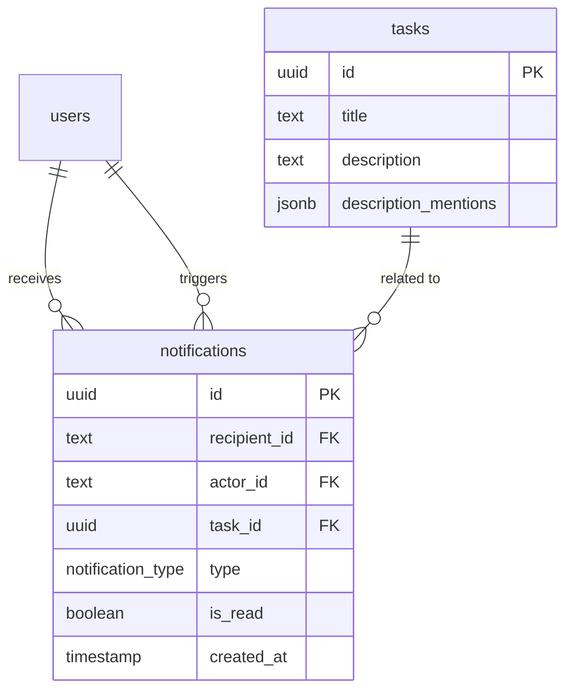

# feat: Sistema de Notificaciones In-App y Email

## Overview

Agregar un sistema de notificaciones a Mira con dos canales: notificaciones in-app (campana con popover en el header) y email (Nodemailer + Gmail SMTP). Cubre dos eventos: asignación de tareas y menciones de usuarios (@). Las notificaciones se persisten en base de datos, se consultan via polling cada 30s, y se marcan como leídas individualmente.

## Problem Statement

Los usuarios no se enteran cuando les asignan una tarea o los mencionan. Deben revisar manualmente el tablero. Esto causa retrasos y tareas que pasan desapercibidas.

## Proposed Solution

### Arquitectura

```
User Action (assign / @mention)
    │
    ├──▶ Server Action (mutation)
    │       ├── Insert into `notifications` table
    │       ├── Insert into `activity` table (existing)
    │       └── after() ──▶ sendEmail() (non-blocking, solo assignments)
    │
    ▼
Client (polling cada 30s → GET /api/notifications/unread-count)
    │
    ├── NotificationBell: muestra badge con count
    └── Popover (on click): fetch lista → render cards
            └── Click card → markAsRead() + navigate to task
```

### ERD



## Technical Approach

### Phase 1: Database Schema + Server Actions

**Files a crear/modificar:**

#### 1.1 Schema — `db/schema.ts` (modificar)

Agregar después de la tabla `attachments` (~línea 97):

```typescript
export const notificationTypeEnum = pgEnum('notification_type', [
  'assigned',
  'mentioned',
]);

export const notifications = pgTable('notifications', {
  id: uuid('id').primaryKey().defaultRandom(),
  recipientId: text('recipient_id').notNull().references(() => users.id, { onDelete: 'cascade' }),
  actorId: text('actor_id').notNull().references(() => users.id, { onDelete: 'cascade' }),
  taskId: uuid('task_id').references(() => tasks.id, { onDelete: 'cascade' }),
  type: notificationTypeEnum('type').notNull(),
  isRead: boolean('is_read').default(false).notNull(),
  createdAt: timestamp('created_at').defaultNow().notNull(),
}, (table) => ({
  recipientIdx: index('notifications_recipient_idx').on(table.recipientId),
  recipientUnreadIdx: index('notifications_recipient_unread_idx').on(table.recipientId, table.isRead),
  createdAtIdx: index('notifications_created_at_idx').on(table.createdAt),
}));
```

Agregar columna `descriptionMentions` a la tabla `tasks`:

```typescript
descriptionMentions: jsonb('description_mentions').$type<string[]>(),
```

#### 1.2 Migración

```bash
pnpm db:generate
pnpm db:push
```

#### 1.3 Server Actions — `app/actions/notifications.ts` (nuevo)

Seguir el patrón exacto de `app/actions/tasks.ts`:

```typescript
// Funciones:
getUnreadCount()        // → { success, data: number }
getNotifications()      // → { success, data: Notification[] } (limit 50, join users para actorName/actorImage)
markNotificationRead(id: string) // → { success } (validar recipientId === currentUser)
createNotification(params)       // helper interno, no exportar como action
```

**Validación de ownership**: `markNotificationRead` debe verificar `WHERE id = ? AND recipientId = currentUserId` para evitar que un usuario marque como leída la notificación de otro.

#### 1.4 Insertar notificaciones en task actions — `app/actions/tasks.ts` (modificar)

**En `assignTask()` (~línea 576-588):** Después de insertar activity de 'assigned', si `newAssigneeId !== userId` (no auto-asignación):

```typescript
await db.insert(notifications).values({
  recipientId: newAssigneeId,
  actorId: userId,
  taskId,
  type: 'assigned',
});
```

**En `completeTask()` (~línea 789-803):** Dentro del loop de mentions, si `mentionedUserId !== userId`:

```typescript
await db.insert(notifications).values({
  recipientId: mentionedUserId,
  actorId: userId,
  taskId: updatedTask.id,
  type: 'mentioned',
});
```

**En `updateTask()` (descripción con menciones):** Al guardar descripción, diff `oldDescriptionMentions` vs `newDescriptionMentions`. Solo notificar user IDs nuevos:

```typescript
const newMentions = newIds.filter(id => !oldIds.includes(id) && id !== userId);
for (const mentionedId of newMentions) {
  await db.insert(notifications).values({
    recipientId: mentionedId,
    actorId: userId,
    taskId,
    type: 'mentioned',
  });
}
```

---

### Phase 2: Email con Nodemailer

**Files a crear/modificar:**

#### 2.1 Lib de email — `lib/email.ts` (nuevo)

```typescript
import nodemailer from 'nodemailer';

const transporter = nodemailer.createTransport({
  service: 'gmail',
  auth: {
    user: process.env.GMAIL_USER,
    pass: process.env.GMAIL_APP_PASSWORD,
  },
});

export async function sendTaskAssignedEmail(params: {
  to: string;
  assignerName: string;
  taskTitle: string;
  taskId: string;
}) {
  const appUrl = process.env.NEXT_PUBLIC_APP_URL || 'http://localhost:3000';
  const taskUrl = `${appUrl}/dashboard?task=${params.taskId}`;

  try {
    await transporter.sendMail({
      from: `"Mira" <${process.env.GMAIL_USER}>`,
      to: params.to,
      subject: `Te asignaron una tarea: ${params.taskTitle}`,
      text: `Hola,\n\n${params.assignerName} te asignó la tarea "${params.taskTitle}" en Mira.\n\nVer tarea: ${taskUrl}\n\n— Mira`,
    });
    return { success: true };
  } catch (error) {
    console.error('Failed to send assignment email:', error);
    return { success: false };
  }
}
```

#### 2.2 Envío non-blocking en `assignTask()` — `app/actions/tasks.ts`

Usar `after()` de `next/server` para enviar email sin bloquear la respuesta:

```typescript
import { after } from 'next/server';
import { sendTaskAssignedEmail } from '@/lib/email';

// Dentro de assignTask, después de insertar notification:
after(async () => {
  const recipient = await db.select().from(users).where(eq(users.id, newAssigneeId)).then(r => r[0]);
  const actor = await db.select().from(users).where(eq(users.id, userId)).then(r => r[0]);
  if (recipient?.email && actor?.name) {
    await sendTaskAssignedEmail({
      to: recipient.email,
      assignerName: actor.name,
      taskTitle: task.title,
      taskId: task.id,
    });
  }
});
```

#### 2.3 Variables de entorno — `.env.example` (modificar)

```
GMAIL_USER=
GMAIL_APP_PASSWORD=
NEXT_PUBLIC_APP_URL=http://localhost:3000
```

#### 2.4 Dependencias

```bash
pnpm add nodemailer
pnpm add -D @types/nodemailer
```

---

### Phase 3: UI — Campana + Popover

**Files a crear/modificar:**

#### 3.1 Instalar Radix Popover

```bash
pnpm add @radix-ui/react-popover
```

#### 3.2 API Route para polling — `app/api/notifications/unread-count/route.ts` (nuevo)

GET endpoint que retorna solo el count (ligero para polling cada 30s):

```typescript
// Returns: { count: number }
```

#### 3.3 API Route para lista — `app/api/notifications/route.ts` (nuevo)

GET endpoint que retorna las últimas 50 notificaciones con datos del actor (join users):

```typescript
// Returns: { items: NotificationWithActor[] }
```

#### 3.4 Hook de polling — `hooks/use-notification-count.ts` (nuevo)

```typescript
// useEffect + setInterval(30000) → fetch /api/notifications/unread-count
// Pausa cuando document.visibilityState === 'hidden'
// Retorna: { unreadCount, refresh }
```

#### 3.5 Componente NotificationBell — `components/notification-bell.tsx` (nuevo)

- Client component con `'use client'`
- Usa `useNotificationCount()` para el badge
- Radix `Popover.Root` / `Popover.Trigger` / `Popover.Content`
- Al abrir popover: fetch `/api/notifications` para cargar lista
- Cada card muestra: avatar del actor, texto descriptivo, tiempo relativo, dot de no leída
- Click en card → `markNotificationRead(id)` server action + `router.push(`/dashboard?task=${taskId}`)`
- Empty state: ícono de campana muted + "No tienes notificaciones"

Texto de las notificaciones:
- Assigned: `"{actorName} te asignó la tarea: {taskTitle}"`
- Mentioned: `"{actorName} te mencionó en la tarea: {taskTitle}"`

#### 3.6 Badge numérico

```tsx
{unreadCount > 0 && (
  <span className="absolute -right-0.5 -top-0.5 flex h-4 min-w-4 items-center justify-center rounded-full bg-destructive px-1 text-[10px] font-medium text-destructive-foreground">
    {unreadCount}
  </span>
)}
```

#### 3.7 Integrar en layout — `app/(dashboard)/layout.tsx` (modificar, ~línea 19-20)

Agregar `<NotificationBell />` antes de `<UserNav />` dentro del div `flex items-center gap-4`.

#### 3.8 Tiempo relativo — `lib/format-relative-time.ts` (nuevo)

Función simple sin dependencias: "hace 5 min", "hace 2h", "hace 3d", o fecha si > 7 días.

---

### Phase 4: @Menciones en Descripción de Tarea

**Files a modificar:**

#### 4.1 Reusar MentionInput — `components/mention-input.tsx` (existente)

El componente `MentionInput` ya tiene autocomplete completo con:
- Formato `@[name](userId)`
- Función `extractMentionIds(text)` para parsear
- Keyboard navigation (arrows, enter, escape)
- Dropdown con avatares

#### 4.2 Integrar en edición de descripción

En el componente donde se edita la descripción de la tarea (dentro de `task-detail-dialog.tsx` o similar), reemplazar el `<textarea>` de descripción con `<MentionInput>`.

#### 4.3 Guardar descriptionMentions en task update

En `updateTask()` server action, al actualizar descripción:
1. Parsear menciones con `extractMentionIds(newDescription)`
2. Comparar con `task.descriptionMentions` (old array)
3. Guardar nuevos IDs en `descriptionMentions` column
4. Crear notification solo para IDs nuevos (no en el array anterior)
5. Excluir auto-menciones (`mentionedId !== userId`)

---

## Acceptance Criteria

### Functional Requirements
- [ ] Al asignar una tarea a otro usuario, el asignado recibe notificación in-app
- [ ] Al asignar una tarea a otro usuario, el asignado recibe email con enlace a la tarea
- [ ] Al mencionar a un usuario en descripción o al completar tarea, el mencionado recibe notificación in-app
- [ ] La campana muestra badge con número exacto de no leídas
- [ ] El popover muestra lista de notificaciones con avatar, texto y tiempo relativo
- [ ] Clic en notificación la marca como leída y navega a la tarea
- [ ] Auto-asignación y auto-mención NO generan notificación
- [ ] Reasignación solo notifica al nuevo asignado
- [ ] Menciones duplicadas en el mismo texto generan una sola notificación
- [ ] Email no bloquea la acción principal (fire-and-forget)
- [ ] Las notificaciones persisten en DB y se muestran al usuario cuando vuelve a conectarse

### Non-Functional Requirements
- [ ] Polling cada 30s con pausa cuando tab no es visible
- [ ] Query de unread count usa índice compuesto `(recipientId, isRead)`
- [ ] Límite de 50 notificaciones en el popover
- [ ] markNotificationRead valida ownership (recipientId === currentUser)
- [ ] Fallo de SMTP se loguea pero no interrumpe el flujo

## Dependencies & Prerequisites

- Credenciales Gmail App Password configuradas en `.env.local`
- Variable `NEXT_PUBLIC_APP_URL` definida
- Paquetes: `nodemailer`, `@types/nodemailer`, `@radix-ui/react-popover`

## Risk Analysis & Mitigation

| Riesgo | Mitigación |
|---|---|
| Gmail SMTP rate limit (500/día) | Suficiente para equipo pequeño. Migrar a Resend/SES si crece |
| Notificaciones acumuladas sin límite | Query con LIMIT 50 + índice compuesto |
| Polling genera carga en DB | Query ligera (count con índice), 30s interval, pausa en tab inactivo |
| Re-notificación al editar descripción | Diff de mentions: solo notificar IDs nuevos vs array guardado |
| Task borrada con notificaciones pendientes | CASCADE delete via FK — notificación desaparece |
| Actor borrado del equipo | CASCADE delete — notificación desaparece (aceptable) |

## Implementation Order

1. **Schema + migración** (notifications table, descriptionMentions column)
2. **Server actions** (notifications.ts: getUnreadCount, getNotifications, markNotificationRead)
3. **API routes** (GET /api/notifications, GET /api/notifications/unread-count)
4. **Email lib** (lib/email.ts + sendTaskAssignedEmail)
5. **Insertar notificaciones en task actions** (assignTask, completeTask, updateTask)
6. **Hook de polling** (hooks/use-notification-count.ts)
7. **NotificationBell + popover** (components/notification-bell.tsx)
8. **Integrar en layout** (app/(dashboard)/layout.tsx)
9. **MentionInput en descripción** (reemplazar textarea en task detail)
10. **Tiempo relativo** (lib/format-relative-time.ts)
11. **Variables de entorno** (.env.example, .env.local)

## Files Summary

| Acción | Archivo |
|---|---|
| Modificar | `db/schema.ts` — agregar notifications table + descriptionMentions column |
| Nuevo | `app/actions/notifications.ts` — server actions de notificaciones |
| Nuevo | `app/api/notifications/route.ts` — GET lista de notificaciones |
| Nuevo | `app/api/notifications/unread-count/route.ts` — GET count no leídas |
| Nuevo | `lib/email.ts` — transporter Nodemailer + sendTaskAssignedEmail |
| Nuevo | `hooks/use-notification-count.ts` — polling hook |
| Nuevo | `components/notification-bell.tsx` — campana + popover |
| Nuevo | `lib/format-relative-time.ts` — "hace X min/h/d" |
| Modificar | `app/actions/tasks.ts` — insertar notificaciones en assign/complete/update |
| Modificar | `app/(dashboard)/layout.tsx` — agregar NotificationBell al header |
| Modificar | Task detail component — usar MentionInput para descripción |
| Modificar | `.env.example` — agregar GMAIL_USER, GMAIL_APP_PASSWORD, NEXT_PUBLIC_APP_URL |

## References

### Internal
- Activity system pattern: `db/schema.ts:68-79`
- Server action pattern: `app/actions/tasks.ts` (ActionResponse type, Zod, getAuth)
- MentionInput component: `components/mention-input.tsx` (autocomplete, extractMentionIds)
- Polling pattern: `components/team-view-auto-refresh.tsx`
- Layout header: `app/(dashboard)/layout.tsx:19-20`
- Task assignment logic: `app/actions/tasks.ts:576-588`
- Task completion mentions: `app/actions/tasks.ts:789-803`
- UserNav component: `components/user-nav.tsx`

### External
- Nodemailer Gmail config: https://nodemailer.com/usage/using-gmail/
- Next.js `after()` API: https://nextjs.org/docs/app/api-reference/functions/after
- Radix Popover: https://www.radix-ui.com/primitives/docs/components/popover
- Gmail App Passwords: https://myaccount.google.com/apppasswords
