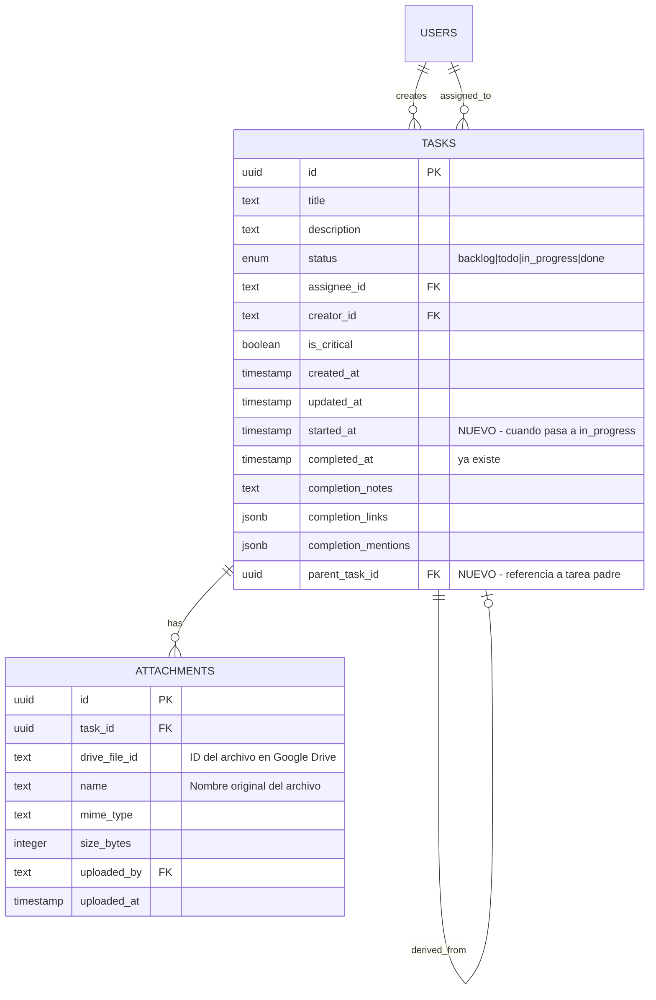

# feat: Task Enhancements - Tracking de Tiempos y Adjuntos

## Overview

Mejorar el sistema de tareas del Kanban de Mira con dos capacidades principales:
1. **Tracking de duración**: Calcular automáticamente cuánto tiempo toma completar cada tarea
2. **Archivos adjuntos**: Permitir subir archivos con almacenamiento temporal en Google Drive

---

## Problem Statement / Motivation

**Problemas actuales:**
- No hay forma de medir cuánto tiempo toma completar una tarea
- Los usuarios no pueden adjuntar archivos de referencia a las tareas
- No existe visibilidad del tiempo invertido por el equipo

**Impacto:**
- Equipos no pueden medir productividad real
- Archivos de trabajo dispersos en múltiples lugares
- Planificación deficiente por falta de datos históricos

---

## Technical Approach

### Arquitectura de Alto Nivel

```
┌─────────────────────────────────────────────────────────────────┐
│                        FRONTEND (React/Next.js)                  │
├─────────────────────────────────────────────────────────────────┤
│  task-card.tsx        │ Muestra duración, icono clip            │
│  task-detail-dialog   │ DateTime picker, sección adjuntos       │
│  kanban-board.tsx     │ Bloquea drag desde Done                 │
│  file-dropzone.tsx    │ NUEVO: Upload con drag & drop           │
│  file-lightbox.tsx    │ NUEVO: Preview de archivos              │
└─────────────────────────────────────────────────────────────────┘
                                    │
                                    ▼
┌─────────────────────────────────────────────────────────────────┐
│                     SERVER ACTIONS (Next.js)                     │
├─────────────────────────────────────────────────────────────────┤
│  tasks.ts             │ updateTaskStatus (captura startedAt)    │
│                       │ updateCompletedAt (editar fecha fin)    │
│                       │ createDerivedTask (con parentTaskId)    │
│  attachments.ts       │ NUEVO: upload, delete, list, download   │
└─────────────────────────────────────────────────────────────────┘
                                    │
                    ┌───────────────┴───────────────┐
                    ▼                               ▼
┌───────────────────────────┐       ┌───────────────────────────┐
│     PostgreSQL (Neon)     │       │      Google Drive API      │
├───────────────────────────┤       ├───────────────────────────┤
│  tasks                    │       │  Mira/                    │
│    + startedAt            │       │    └── tasks/             │
│    + completedAt (existe) │       │        └── {taskId}/      │
│    + parentTaskId         │       │            ├── file1.pdf  │
│  attachments (NUEVA)      │       │            └── file2.png  │
│    - id, taskId, driveId  │       └───────────────────────────┘
│    - name, mimeType, size │
│    - uploadedAt           │
└───────────────────────────┘
                                    │
                                    ▼
┌─────────────────────────────────────────────────────────────────┐
│                     CRON JOB (Vercel)                            │
├─────────────────────────────────────────────────────────────────┤
│  /api/cron/cleanup-attachments                                  │
│  - Ejecuta diariamente a las 3:00 AM UTC                        │
│  - Elimina archivos de tareas completadas hace +3 días          │
└─────────────────────────────────────────────────────────────────┘
```

### ERD - Cambios en Modelo de Datos



---

## Implementation Phases

### Phase 1: Schema & Backend para Tracking de Tiempos

**Objetivo:** Agregar campos de tracking y lógica de captura automática

#### Task 1.1: Migración de Base de Datos

**Archivo:** `db/schema.ts:42-60`

```typescript
// Agregar después de línea 53 (completionMentions)
startedAt: timestamp('started_at'),
parentTaskId: uuid('parent_task_id').references((): AnyPgColumn => tasks.id, { onDelete: 'set null' }),
```

**Comandos:**
```bash
npm run db:generate
npm run db:push
```

**Criterio de éxito:** Campos `started_at` y `parent_task_id` visibles en Drizzle Studio

---

#### Task 1.2: Captura Automática de startedAt

**Archivo:** `app/actions/tasks.ts:242-249`

```typescript
// En updateTaskStatus(), modificar el .set()
.set({
  status: newStatus,
  updatedAt: new Date(),
  // NUEVO: Capturar startedAt al mover a in_progress
  ...(newStatus === 'in_progress' && !currentTask.startedAt
    ? { startedAt: new Date() }
    : {}),
  // NUEVO: Limpiar startedAt si vuelve a backlog/todo
  ...(newStatus === 'backlog' || newStatus === 'todo'
    ? { startedAt: null }
    : {}),
})
```

**Criterio de éxito:** Mover tarea a "In Progress" registra timestamp en BD

---

#### Task 1.3: Bloquear Movimiento desde Done

**Archivo:** `components/kanban-board.tsx:159-160`

```typescript
// Después de verificar si cambió el status (línea 159)
if (task.status === 'done') {
  toast.error('Las tareas completadas no se pueden mover. Crea una tarea derivada.');
  return;
}
```

**Criterio de éxito:** Arrastrar tarea desde "Done" muestra toast de error

---

#### Task 1.4: Edición de completedAt (Solo Owner)

**Archivo:** `app/actions/tasks.ts` (nueva función)

```typescript
export async function updateCompletedAt(taskId: string, completedAt: Date) {
  const { userId } = await auth();
  if (!userId) throw new Error('Unauthorized');

  const task = await db.query.tasks.findFirst({
    where: eq(tasks.id, taskId)
  });

  // Solo el assignee o creator puede editar
  if (task?.assigneeId !== userId && task?.creatorId !== userId) {
    return { error: 'Solo el responsable puede editar la fecha de completado' };
  }

  await db.update(tasks)
    .set({ completedAt, updatedAt: new Date() })
    .where(eq(tasks.id, taskId));

  return { success: true };
}
```

**Criterio de éxito:** Owner puede editar fecha, otros usuarios reciben error

---

#### Task 1.5: Crear Tarea Derivada

**Archivo:** `app/actions/tasks.ts` (nueva función)

```typescript
export async function createDerivedTask(parentTaskId: string, title: string) {
  const { userId } = await auth();
  if (!userId) throw new Error('Unauthorized');

  const parentTask = await db.query.tasks.findFirst({
    where: eq(tasks.id, parentTaskId)
  });

  if (!parentTask) {
    return { error: 'Tarea padre no encontrada' };
  }

  const [newTask] = await db.insert(tasks).values({
    title: title || `Continuación: ${parentTask.title}`,
    description: parentTask.description,
    status: 'todo',
    assigneeId: parentTask.assigneeId,
    creatorId: userId,
    parentTaskId: parentTaskId,
  }).returning();

  // Registrar en activity
  await createActivity(newTask.id, userId, 'created', {
    derivedFrom: parentTaskId
  });

  return { success: true, task: newTask };
}
```

**Criterio de éxito:** Nueva tarea creada con referencia a `parentTaskId`

---

### Phase 2: UI para Tracking de Tiempos

**Objetivo:** Mostrar duración en cards y modal, agregar date picker

#### Task 2.1: Función Helper para Formatear Duración

**Archivo:** `lib/format-duration.ts` (NUEVO)

```typescript
export function formatDuration(startedAt: Date | null, completedAt: Date | null): string {
  if (!startedAt) return '-';

  const end = completedAt || new Date();
  const diffMs = end.getTime() - startedAt.getTime();

  const hours = Math.floor(diffMs / (1000 * 60 * 60));
  const minutes = Math.floor((diffMs % (1000 * 60 * 60)) / (1000 * 60));

  if (hours > 24) {
    const days = Math.floor(hours / 24);
    const remainingHours = hours % 24;
    return `${days}d ${remainingHours}h`;
  }

  return hours > 0 ? `${hours}h ${minutes}m` : `${minutes}m`;
}
```

---

#### Task 2.2: Mostrar Duración en Task Card

**Archivo:** `components/task-card.tsx:161-164`

```typescript
// Reemplazar el status indicator por duración cuando está en done
{task.status === 'done' && task.startedAt ? (
  <span className="text-green-400 font-mono">
    {formatDuration(new Date(task.startedAt), new Date(task.completedAt!))}
  </span>
) : task.status === 'in_progress' && task.startedAt ? (
  <span className="text-amber-400 font-mono animate-pulse">
    {formatDuration(new Date(task.startedAt), null)}
  </span>
) : (
  <div
    className="h-1.5 w-1.5 rounded-full"
    style={{ backgroundColor: `var(--status-${task.status.replace('_', '')})` }}
  />
)}
```

**Criterio de éxito:** Cards en Done muestran "2h 30m", cards en In Progress muestran tiempo corriendo

---

#### Task 2.3: DateTime Picker en Task Detail Modal

**Archivo:** `components/task-detail-dialog.tsx:166-181`

Agregar sección expandida con:
- `startedAt` (solo lectura)
- `completedAt` (editable con date-time picker si es owner)
- Duración calculada
- Botón "Crear tarea derivada" si status === 'done'

```typescript
// Después de "Last Updated" (línea 178)
{task.startedAt && (
  <div className="flex justify-between py-1 border-b border-white/5">
    <span className="opacity-40">Iniciada</span>
    <span>{format(new Date(task.startedAt), 'PPp', { locale: es })}</span>
  </div>
)}

{task.completedAt && (
  <div className="flex justify-between py-1 border-b border-white/5">
    <span className="opacity-40">Completada</span>
    {isOwner ? (
      <DateTimePicker
        value={new Date(task.completedAt)}
        onChange={(date) => handleUpdateCompletedAt(date)}
      />
    ) : (
      <span>{format(new Date(task.completedAt), 'PPp', { locale: es })}</span>
    )}
  </div>
)}

{task.startedAt && task.completedAt && (
  <div className="flex justify-between py-1 border-b border-white/5">
    <span className="opacity-40">Duración</span>
    <span className="text-green-400 font-mono font-bold">
      {formatDuration(new Date(task.startedAt), new Date(task.completedAt))}
    </span>
  </div>
)}

{task.status === 'done' && (
  <Button
    variant="outline"
    size="sm"
    onClick={() => setShowDerivedTaskDialog(true)}
  >
    <GitBranch className="h-4 w-4 mr-2" />
    Crear tarea derivada
  </Button>
)}
```

---

### Phase 3: Google Drive Integration

**Objetivo:** Configurar backend para subir/eliminar archivos en Drive

#### Task 3.1: Configurar Google Drive Client

**Archivo:** `lib/google-drive.ts` (NUEVO)

```typescript
import { google } from 'googleapis';

const SCOPES = ['https://www.googleapis.com/auth/drive.file'];

export function getGoogleDriveClient() {
  const credentials = JSON.parse(process.env.GOOGLE_SERVICE_ACCOUNT_KEY || '{}');

  const auth = new google.auth.GoogleAuth({
    credentials,
    scopes: SCOPES,
  });

  return google.drive({ version: 'v3', auth });
}

export const MIRA_FOLDER_ID = process.env.GOOGLE_DRIVE_FOLDER_ID!;
```

**Variables de entorno a agregar:**
```env
GOOGLE_SERVICE_ACCOUNT_KEY={"type":"service_account",...}
GOOGLE_DRIVE_FOLDER_ID=1abc123...
```

---

#### Task 3.2: Schema para Attachments

**Archivo:** `db/schema.ts` (agregar después de `activity` table)

```typescript
export const attachments = pgTable('attachments', {
  id: uuid('id').primaryKey().defaultRandom(),
  taskId: uuid('task_id').notNull().references(() => tasks.id, { onDelete: 'cascade' }),
  driveFileId: text('drive_file_id').notNull(),
  name: text('name').notNull(),
  mimeType: text('mime_type').notNull(),
  sizeBytes: integer('size_bytes').notNull(),
  uploadedBy: text('uploaded_by').notNull().references(() => users.id),
  uploadedAt: timestamp('uploaded_at').defaultNow().notNull(),
}, (table) => ({
  taskIdx: index('attachment_task_idx').on(table.taskId),
}));
```

---

#### Task 3.3: Server Actions para Attachments

**Archivo:** `app/actions/attachments.ts` (NUEVO)

```typescript
'use server';

import { db } from '@/db';
import { attachments, tasks } from '@/db/schema';
import { auth } from '@clerk/nextjs/server';
import { getGoogleDriveClient, MIRA_FOLDER_ID } from '@/lib/google-drive';
import { eq } from 'drizzle-orm';
import { Readable } from 'stream';

// Tipos de archivo permitidos
const ALLOWED_TYPES = [
  'image/jpeg', 'image/png', 'image/gif', 'image/webp', 'image/svg+xml',
  'video/mp4', 'video/quicktime', 'video/x-msvideo', 'video/webm',
  'application/pdf',
  'application/msword', 'application/vnd.openxmlformats-officedocument.wordprocessingml.document',
  'application/vnd.ms-excel', 'application/vnd.openxmlformats-officedocument.spreadsheetml.sheet',
  'application/vnd.ms-powerpoint', 'application/vnd.openxmlformats-officedocument.presentationml.presentation',
  'text/plain', 'text/markdown',
];

export async function uploadAttachment(formData: FormData) {
  const { userId } = await auth();
  if (!userId) return { error: 'Unauthorized' };

  const file = formData.get('file') as File;
  const taskId = formData.get('taskId') as string;

  if (!file || !taskId) {
    return { error: 'Archivo y tarea requeridos' };
  }

  // Validar tipo de archivo
  if (!ALLOWED_TYPES.includes(file.type)) {
    return { error: 'Tipo de archivo no permitido' };
  }

  // Verificar que tarea no esté en Done
  const task = await db.query.tasks.findFirst({
    where: eq(tasks.id, taskId)
  });

  if (task?.status === 'done') {
    return { error: 'No se pueden agregar adjuntos a tareas completadas' };
  }

  const drive = getGoogleDriveClient();

  try {
    // Obtener o crear carpeta de la tarea
    const folderId = await getOrCreateTaskFolder(drive, taskId);

    // Subir archivo a Drive
    const buffer = Buffer.from(await file.arrayBuffer());
    const stream = Readable.from(buffer);

    const driveResponse = await drive.files.create({
      requestBody: {
        name: file.name,
        mimeType: file.type,
        parents: [folderId],
      },
      media: {
        mimeType: file.type,
        body: stream,
      },
      fields: 'id, name, webViewLink',
    });

    // Guardar referencia en BD
    const [attachment] = await db.insert(attachments).values({
      taskId,
      driveFileId: driveResponse.data.id!,
      name: file.name,
      mimeType: file.type,
      sizeBytes: file.size,
      uploadedBy: userId,
    }).returning();

    return { success: true, attachment };
  } catch (error) {
    console.error('Upload error:', error);
    return { error: 'Error al subir archivo' };
  }
}

async function getOrCreateTaskFolder(drive: any, taskId: string): Promise<string> {
  // Buscar carpeta existente
  const query = `name='${taskId}' and '${MIRA_FOLDER_ID}' in parents and mimeType='application/vnd.google-apps.folder' and trashed=false`;

  const existing = await drive.files.list({
    q: query,
    fields: 'files(id)',
  });

  if (existing.data.files?.length > 0) {
    return existing.data.files[0].id;
  }

  // Crear carpeta
  const folder = await drive.files.create({
    requestBody: {
      name: taskId,
      mimeType: 'application/vnd.google-apps.folder',
      parents: [MIRA_FOLDER_ID],
    },
    fields: 'id',
  });

  return folder.data.id!;
}

export async function deleteAttachment(attachmentId: string) {
  const { userId } = await auth();
  if (!userId) return { error: 'Unauthorized' };

  const attachment = await db.query.attachments.findFirst({
    where: eq(attachments.id, attachmentId)
  });

  if (!attachment) {
    return { error: 'Adjunto no encontrado' };
  }

  const drive = getGoogleDriveClient();

  try {
    await drive.files.delete({ fileId: attachment.driveFileId });
    await db.delete(attachments).where(eq(attachments.id, attachmentId));

    return { success: true };
  } catch (error) {
    console.error('Delete error:', error);
    return { error: 'Error al eliminar archivo' };
  }
}

export async function getTaskAttachments(taskId: string) {
  return db.query.attachments.findMany({
    where: eq(attachments.taskId, taskId),
    orderBy: (attachments, { desc }) => [desc(attachments.uploadedAt)],
  });
}
```

---

#### Task 3.4: API Route para Descarga

**Archivo:** `app/api/attachments/[id]/download/route.ts` (NUEVO)

```typescript
import { NextRequest, NextResponse } from 'next/server';
import { auth } from '@clerk/nextjs/server';
import { db } from '@/db';
import { attachments } from '@/db/schema';
import { eq } from 'drizzle-orm';
import { getGoogleDriveClient } from '@/lib/google-drive';

export async function GET(
  request: NextRequest,
  { params }: { params: { id: string } }
) {
  const { userId } = await auth();
  if (!userId) {
    return NextResponse.json({ error: 'Unauthorized' }, { status: 401 });
  }

  const attachment = await db.query.attachments.findFirst({
    where: eq(attachments.id, params.id)
  });

  if (!attachment) {
    return NextResponse.json({ error: 'Not found' }, { status: 404 });
  }

  const drive = getGoogleDriveClient();

  const response = await drive.files.get(
    { fileId: attachment.driveFileId, alt: 'media' },
    { responseType: 'stream' }
  );

  const headers = new Headers();
  headers.set('Content-Type', attachment.mimeType);
  headers.set('Content-Disposition', `attachment; filename="${attachment.name}"`);

  return new NextResponse(response.data as any, { headers });
}
```

---

### Phase 4: UI para Adjuntos

**Objetivo:** Componentes de upload, visualización y descarga

#### Task 4.1: Componente Dropzone

**Archivo:** `components/file-dropzone.tsx` (NUEVO)

```typescript
'use client';

import { useCallback, useState } from 'react';
import { Upload, X, File, Image, Video, FileText } from 'lucide-react';
import { cn } from '@/lib/utils';
import { uploadAttachment } from '@/app/actions/attachments';
import { toast } from 'sonner';

interface FileDropzoneProps {
  taskId: string;
  onUploadComplete: () => void;
  disabled?: boolean;
}

export function FileDropzone({ taskId, onUploadComplete, disabled }: FileDropzoneProps) {
  const [isDragging, setIsDragging] = useState(false);
  const [uploading, setUploading] = useState(false);

  const handleDrop = useCallback(async (e: React.DragEvent) => {
    e.preventDefault();
    setIsDragging(false);

    if (disabled) return;

    const files = Array.from(e.dataTransfer.files);
    await uploadFiles(files);
  }, [taskId, disabled]);

  const uploadFiles = async (files: File[]) => {
    setUploading(true);

    for (const file of files) {
      const formData = new FormData();
      formData.append('file', file);
      formData.append('taskId', taskId);

      const result = await uploadAttachment(formData);

      if (result.error) {
        toast.error(`Error subiendo ${file.name}: ${result.error}`);
      } else {
        toast.success(`${file.name} subido correctamente`);
      }
    }

    setUploading(false);
    onUploadComplete();
  };

  return (
    <div
      onDragEnter={() => !disabled && setIsDragging(true)}
      onDragLeave={() => setIsDragging(false)}
      onDragOver={(e) => e.preventDefault()}
      onDrop={handleDrop}
      className={cn(
        "border-2 border-dashed rounded-lg p-6 text-center transition-colors",
        isDragging ? "border-primary bg-primary/5" : "border-white/10",
        disabled && "opacity-50 cursor-not-allowed"
      )}
    >
      <input
        type="file"
        multiple
        onChange={(e) => uploadFiles(Array.from(e.target.files || []))}
        className="hidden"
        id="file-upload"
        disabled={disabled}
      />
      <label htmlFor="file-upload" className="cursor-pointer">
        <Upload className={cn("mx-auto h-8 w-8", uploading && "animate-bounce")} />
        <p className="mt-2 text-sm text-muted-foreground">
          {uploading ? 'Subiendo...' : 'Arrastra archivos o haz clic para seleccionar'}
        </p>
      </label>
    </div>
  );
}
```

---

#### Task 4.2: Componente Lista de Adjuntos

**Archivo:** `components/attachment-list.tsx` (NUEVO)

```typescript
'use client';

import { useState } from 'react';
import { File, Image, Video, FileText, Download, Trash2, ExternalLink } from 'lucide-react';
import { Button } from '@/components/ui/button';
import { deleteAttachment } from '@/app/actions/attachments';
import { toast } from 'sonner';

interface Attachment {
  id: string;
  name: string;
  mimeType: string;
  sizeBytes: number;
  uploadedAt: Date;
}

interface AttachmentListProps {
  attachments: Attachment[];
  onDelete: () => void;
  readonly?: boolean;
}

export function AttachmentList({ attachments, onDelete, readonly }: AttachmentListProps) {
  const [deleting, setDeleting] = useState<string | null>(null);

  const getIcon = (mimeType: string) => {
    if (mimeType.startsWith('image/')) return Image;
    if (mimeType.startsWith('video/')) return Video;
    return FileText;
  };

  const formatSize = (bytes: number) => {
    if (bytes < 1024) return `${bytes} B`;
    if (bytes < 1024 * 1024) return `${(bytes / 1024).toFixed(1)} KB`;
    return `${(bytes / (1024 * 1024)).toFixed(1)} MB`;
  };

  const handleDelete = async (id: string) => {
    setDeleting(id);
    const result = await deleteAttachment(id);

    if (result.error) {
      toast.error(result.error);
    } else {
      toast.success('Adjunto eliminado');
      onDelete();
    }
    setDeleting(null);
  };

  if (attachments.length === 0) {
    return (
      <p className="text-sm text-muted-foreground text-center py-4">
        Sin adjuntos
      </p>
    );
  }

  return (
    <div className="space-y-2">
      {attachments.map((attachment) => {
        const Icon = getIcon(attachment.mimeType);

        return (
          <div
            key={attachment.id}
            className="flex items-center gap-3 p-2 rounded-lg bg-white/5 hover:bg-white/10 transition-colors"
          >
            <Icon className="h-5 w-5 text-muted-foreground shrink-0" />

            <div className="flex-1 min-w-0">
              <p className="text-sm font-medium truncate">{attachment.name}</p>
              <p className="text-xs text-muted-foreground">
                {formatSize(attachment.sizeBytes)}
              </p>
            </div>

            <div className="flex gap-1">
              <Button
                variant="ghost"
                size="icon-sm"
                asChild
              >
                <a href={`/api/attachments/${attachment.id}/download`} download>
                  <Download className="h-4 w-4" />
                </a>
              </Button>

              {!readonly && (
                <Button
                  variant="ghost"
                  size="icon-sm"
                  onClick={() => handleDelete(attachment.id)}
                  disabled={deleting === attachment.id}
                >
                  <Trash2 className="h-4 w-4 text-destructive" />
                </Button>
              )}
            </div>
          </div>
        );
      })}

      {attachments.length > 1 && (
        <Button
          variant="outline"
          size="sm"
          className="w-full"
          asChild
        >
          <a href={`/api/attachments/download-all?taskId=${attachments[0].taskId}`}>
            <Download className="h-4 w-4 mr-2" />
            Descargar todos ({attachments.length})
          </a>
        </Button>
      )}
    </div>
  );
}
```

---

#### Task 4.3: Icono Clip en Task Card

**Archivo:** `components/task-card.tsx:140-165`

```typescript
// En el footer del card, agregar después del assignee
{task.attachmentCount > 0 && (
  <div className="flex items-center gap-1 text-muted-foreground">
    <Paperclip className="h-3 w-3" />
    <span className="text-[10px]">{task.attachmentCount}</span>
  </div>
)}
```

**Nota:** Requiere agregar `attachmentCount` al query de `getKanbanData()`

---

#### Task 4.4: Sección Adjuntos en Task Detail Modal

**Archivo:** `components/task-detail-dialog.tsx` (después de línea 196)

```typescript
{/* Sección Adjuntos */}
<div className="space-y-4">
  <label className="text-[10px] font-black uppercase tracking-[0.2em] text-muted-foreground flex items-center gap-2">
    <Paperclip className="h-3 w-3" /> Adjuntos
  </label>

  {task.status !== 'done' && (
    <FileDropzone
      taskId={task.id}
      onUploadComplete={refetchAttachments}
    />
  )}

  <AttachmentList
    attachments={attachments}
    onDelete={refetchAttachments}
    readonly={task.status === 'done'}
  />
</div>
```

---

### Phase 5: Cron Job para Limpieza

**Objetivo:** Eliminar automáticamente archivos de tareas completadas +3 días

#### Task 5.1: Configuración Vercel Cron

**Archivo:** `vercel.json`

```json
{
  "$schema": "https://openapi.vercel.sh/vercel.json",
  "crons": [
    {
      "path": "/api/cron/cleanup-attachments",
      "schedule": "0 3 * * *"
    }
  ]
}
```

---

#### Task 5.2: API Route del Cron Job

**Archivo:** `app/api/cron/cleanup-attachments/route.ts` (NUEVO)

```typescript
import { NextRequest, NextResponse } from 'next/server';
import { db } from '@/db';
import { tasks, attachments } from '@/db/schema';
import { eq, lte, and, isNotNull } from 'drizzle-orm';
import { getGoogleDriveClient, MIRA_FOLDER_ID } from '@/lib/google-drive';

export const runtime = 'nodejs';
export const maxDuration = 60;

export async function GET(request: NextRequest) {
  // Verificar que viene de Vercel Cron
  const authHeader = request.headers.get('authorization');
  if (authHeader !== `Bearer ${process.env.CRON_SECRET}`) {
    return NextResponse.json({ error: 'Unauthorized' }, { status: 401 });
  }

  const drive = getGoogleDriveClient();

  // Calcular fecha límite (3 días atrás)
  const cutoffDate = new Date();
  cutoffDate.setDate(cutoffDate.getDate() - 3);

  try {
    // Buscar tareas completadas hace más de 3 días con adjuntos
    const tasksToClean = await db
      .select({ id: tasks.id })
      .from(tasks)
      .where(
        and(
          eq(tasks.status, 'done'),
          isNotNull(tasks.completedAt),
          lte(tasks.completedAt, cutoffDate)
        )
      );

    let deletedCount = 0;
    let errorCount = 0;

    for (const task of tasksToClean) {
      // Obtener adjuntos de la tarea
      const taskAttachments = await db.query.attachments.findMany({
        where: eq(attachments.taskId, task.id)
      });

      if (taskAttachments.length === 0) continue;

      // Eliminar archivos de Drive
      for (const attachment of taskAttachments) {
        try {
          await drive.files.delete({ fileId: attachment.driveFileId });
          deletedCount++;
        } catch (error) {
          console.error(`Error deleting file ${attachment.driveFileId}:`, error);
          errorCount++;
        }
      }

      // Eliminar registros de BD
      await db.delete(attachments).where(eq(attachments.taskId, task.id));

      // Intentar eliminar carpeta de la tarea
      try {
        const folders = await drive.files.list({
          q: `name='${task.id}' and '${MIRA_FOLDER_ID}' in parents and mimeType='application/vnd.google-apps.folder'`,
          fields: 'files(id)',
        });

        if (folders.data.files?.[0]) {
          await drive.files.delete({ fileId: folders.data.files[0].id });
        }
      } catch (error) {
        console.error(`Error deleting folder for task ${task.id}:`, error);
      }
    }

    return NextResponse.json({
      success: true,
      tasksProcessed: tasksToClean.length,
      filesDeleted: deletedCount,
      errors: errorCount,
      cutoffDate: cutoffDate.toISOString(),
    });
  } catch (error) {
    console.error('Cleanup error:', error);
    return NextResponse.json({ error: 'Cleanup failed' }, { status: 500 });
  }
}
```

---

## Acceptance Criteria

### Functional Requirements

- [ ] **F1**: Al mover tarea a "In Progress", se registra `startedAt` automáticamente
- [ ] **F2**: Al mover tarea a "Done", se registra `completedAt` automáticamente
- [ ] **F3**: Tareas en "Done" NO pueden moverse a otras columnas (toast de error)
- [ ] **F4**: Solo el assignee/creator puede editar `completedAt` de una tarea
- [ ] **F5**: Se puede crear tarea derivada con referencia a `parentTaskId`
- [ ] **F6**: Duración visible en card del Kanban para tareas completadas
- [ ] **F7**: Duración en tiempo real para tareas en progreso
- [ ] **F8**: Usuarios pueden subir archivos a tareas no completadas
- [ ] **F9**: Archivos se almacenan en Google Drive bajo `Mira/tasks/{taskId}/`
- [ ] **F10**: Usuarios pueden descargar archivos individualmente
- [ ] **F11**: Usuarios pueden descargar todos los adjuntos en ZIP
- [ ] **F12**: Usuarios pueden eliminar adjuntos de tareas no completadas
- [ ] **F13**: Icono de clip visible en cards con adjuntos
- [ ] **F14**: Cron job elimina adjuntos 3 días después de completar tarea

### Non-Functional Requirements

- [ ] **NF1**: Upload de archivos muestra progress/loading state
- [ ] **NF2**: Errores de Google Drive API se manejan con mensajes claros
- [ ] **NF3**: Tipos de archivo restringidos a imágenes, videos y documentos comunes
- [ ] **NF4**: Cron job tiene timeout de 60 segundos
- [ ] **NF5**: Todas las acciones requieren autenticación

### Quality Gates

- [ ] Tests unitarios para `formatDuration()`
- [ ] Tests de integración para Server Actions de attachments
- [ ] Tests E2E con Playwright para flujo completo de tracking
- [ ] Tests E2E para flujo de upload/download de archivos

---

## Dependencies & Prerequisites

1. **Google Cloud Project** con Drive API habilitada
2. **Service Account** con acceso a carpeta compartida de Drive
3. **Variables de entorno**:
   - `GOOGLE_SERVICE_ACCOUNT_KEY`
   - `GOOGLE_DRIVE_FOLDER_ID`
   - `CRON_SECRET` (para Vercel)
4. **Paquete npm**: `googleapis`

---

## Risk Analysis & Mitigation

| Riesgo | Probabilidad | Impacto | Mitigación |
|--------|--------------|---------|------------|
| Google Drive API rate limits | Media | Alto | Implementar retry con exponential backoff |
| Token de Service Account expira | Baja | Alto | googleapis maneja refresh automático |
| Archivos huérfanos en Drive | Media | Bajo | Cron job limpia carpetas vacías |
| Usuario edita completedAt a fecha futura | Baja | Medio | Validar que fecha no sea mayor a now() |
| Cron job falla silenciosamente | Media | Medio | Logging detallado + alertas |

---

## References

### Internal References
- Schema actual: `db/schema.ts:42-60`
- Task actions: `app/actions/tasks.ts`
- Task card: `components/task-card.tsx:140-165`
- Task detail modal: `components/task-detail-dialog.tsx:166-196`
- Kanban drag handler: `components/kanban-board.tsx:127-214`

### External References
- [Google Drive API - Node.js](https://developers.google.com/workspace/drive/api/quickstart/nodejs)
- [Drizzle ORM - Self-referencing FK](https://orm.drizzle.team/docs/indexes-constraints#foreign-keys)
- [Vercel Cron Jobs](https://vercel.com/docs/cron-jobs)
- [Next.js Server Actions - File Uploads](https://nextjs.org/docs/app/building-your-application/data-fetching/server-actions-and-mutations)

---

## Notes

**Decisiones tomadas:**
- Owner = assignee OR creator (cualquiera puede editar completedAt)
- startedAt se resetea a null si tarea vuelve a backlog/todo
- Sin límite de tamaño de archivos (confiamos en límites de Drive)
- Eliminación automática sin notificación previa (usuario informado en UI)
- Tareas derivadas heredan: title (prefijo), description, assignee

**Trade-offs:**
- Sin preview inline de archivos (solo descarga) para simplificar MVP
- Sin historial de transiciones de estado (solo startedAt/completedAt)
- Sin versionado de archivos adjuntos
